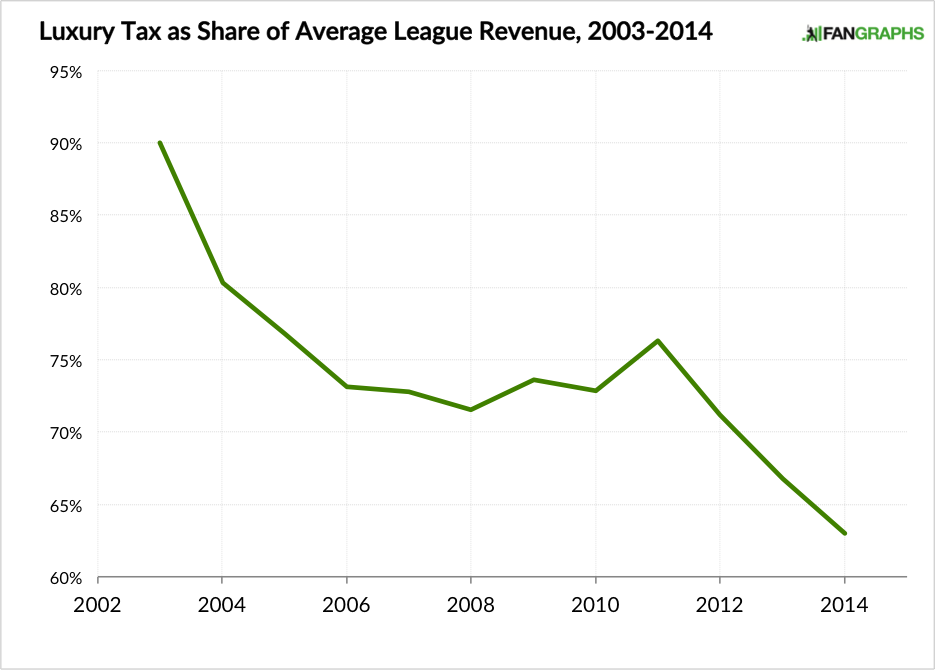
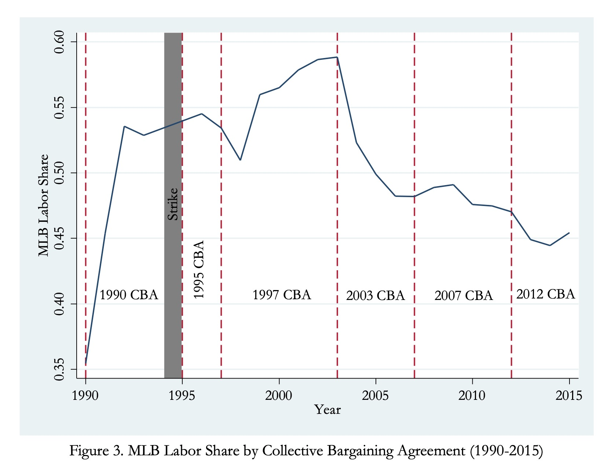
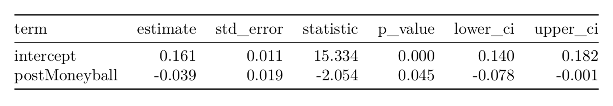
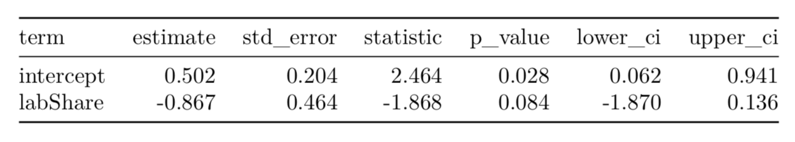

```{r setup, include=FALSE}
# setup chunks
knitr::opts_chunk$set(echo = F, fig.align = "center", warning = F, message = F, fig.height = 2.75, fig.width = 4)
# load libaries
library(tidyverse)
library(knitr)
library(grid)
library(gridExtra)
library(patchwork)
library(moderndive)
library(ggrepel)
library(ISLR)
# Read global header file (imports datasets and does initial wrangling)
source(file = "R/header.R")
source(file = "R/presentation.R")
```

# Research Question

The MLB's "luxury tax," implemented in the 2003 Collective Bargaining Agreement, is a rule penalizing franchises whose team payroll for a given year exceeds an agreed threshold. This project attempts to test the tax's effect on quality of play by studying the number of above-rookie retirees (referred to here as "couldabeens") as a share of total retirements.

# Why does the luxury tax matter?

Although originally pitched as a way to "even the playing field," the luxury tax has increasingly functioned as a salary cap. Existing literature has established a continuing decline in labor share in the MLB since the 2003 CBA (Bradbury, 2019).

\[
Labor \: Share = \frac{Total \: MLB \: Revenue}{Total \: MLB \: Player \: Payroll}
\]

::: columns
:::: column
```{r, out.width = "100%"}
if(bimage){}
```
::::
:::: column
```{r, out.width = "100%"}
if(bimage){}
```
::::
:::

# Theory

How might the "luxury tax" increase the number of above-rookie retirees?

- Players don't gain free agency until six years of MLB service time, making rookies cheaper than veterans.
- Farm teams not counted towards salary threshold, guaranteeing reserve pool of rookies.
- Teams direct limited budget towards retaining a handful of elite veterans, filling out roster with rookies.
- Hypothesis: Good-but-not-Mike-Trout veterans replaced with marginally inferior rookies to stay below salary threshold.

# Methods: The Data

We got our data from https://stathead.com/baseball/ and divided it into four data sets:

1. Rookie pitchers
2. Rookie position players
3. Retired pitchers
4. Retired position players

# Methods: WAR

Wins Above Replacement, or WAR, is a baseball statistic which seeks to measure a player's total contribution to his team. A WAR of 0.3 means the player's team will win 0.3 more games per season than if he had been substituted for a replacement-level player.

Position WAR:
\[
WAR = \frac{(Player \: Runs - Average \: Runs) + (Average \: Runs - Replacement \:Runs)}{Game \: Runs \: to \: Wins \: Estimator}
\]

where

\[
Player \: Runs = Batting \: Runs + Baserunning \: Runs + Double \: Play \: Runs + Fielding \: Runs + Positional \: Adjustment
\]

Pitcher WAR:

\[
WAR = \frac{(Adjusted \: Average \: Runs \: Allowed - Adjusted \: Player \: Runs \: Allowed) + (Adjusted \: Replacement \:Runs \: Allowed - Adjusted \: Average \: Runs \: Allowed)}{Game \: Runs \: to \: Wins \: Estimator}
\]

However, the "replacement-level player" used in WAR is an estimate for the average *midseason* replacement. Being better than a midseason replacement does not necessarily make you better than the generation of rookies *actually* replacing you.

# Methods: The Couldabeen Classifier

We want to calculate whether a given retiring player is better than the average rookie replacing him. For a given year $Y$, we first compute the mean rookie's WAR, call it $Rookie_Y$. Then, we construct the corresponding classifier for "couldabeen" status $C$ of a given retired player $p$ (from the year $Y$) to be as follows:
\[
C(p) = \begin{cases}
True, \,  \text{WAR}_p \geq Rookie_Y \\
False, \, \text{WAR}_p < Rookie_Y 
\end{cases}
\]

# Visualization: Couldabeen Classification

```{r, fig.height = 3, fig.width = 5}
if(bplot){grid.arrange(dens_pit, dens_pos, nrow = 2)}
```

# Methods: Modeling

 **Linear Model:** After classifying all retired players, get proportion of "couldbaeen" retirees and call this `prop`.
 
- As such, we now have $50$ data points (for each year), so we run a linear model fitting `Year ~ prop`.
- Because there will always be "couldabeens", we do not expect a large effect size and hence a very significant result.
- If our research hypothesis is correct (that there is an effect), we expect to see a positive coefficient for $\beta_{Year}$.

# Linear Model: Year

```{r, fig.height = 2.75, message = F, echo = F}
plot_lm1
```


# A Confounding Variable: *Moneyball* and the Sabermetric Revolution

\begin{quote}
"Sabermetrics is the search for objective knowledge about baseball through analysis of the statistical record." - from the Society for American Baseball Research, or SABR
\end{quote}

# A Confounding Variable: *Moneyball* and the Sabermetric Revolution

Timeline:

1977: Bill James, inventor of term "sabermetrics," publishes first "book": *1977 Baseball Abstract*. It sells 75 copies.

1997: Billy Beane promoted to general manager of Oakland Athletics. He's ready every *Baseball Abstract* ever published.

(October 2002): Athletics finish season with MLB's best record and second-lowest budget.

(November 2002): Beane declines $12.5 million offer from Boston Red Sox. Boston hires Bill James instead.

(June 2003): Michael Lewis publishes *Moneyball: The Art of Winning an Unfair Game*.

# A Confounding Variable: *Moneyball* and the Sabermetric Revolution

(October 2004): Boston wins their first World Series since 1918.

(2006): *Time* lists Bill James among "100 Most Influential People in the World." Nearly every MLB franchise employs a sabermetrics team.

\begin{quote}
"[Presidential politics] reminded me of baseball, when you see the same recycled clichés and conventional wisdoms over and over again, some of which isn’t very wise." - Former *Baseball Prospectus* partner Nate Silver, on why he founded *538*
\end{quote}

# Hypothesis Test: Why Split the Data?

Since the release of Moneyball in 2003 seems to be an important **confounding variable**, we perform a hypothesis test on the `postMoneyball` classifier of a year $Y$, defined as follows:
\[
\text{postMoneyball}(Y) = \begin{cases}
True, Y > 2003 \\
False, Y \leq 2003
\end{cases}
\]

- We fit a model `Year ~ postMoneyball` and perform *LSS*.

```{r, out.width = "90%"}

```

# Linear Model on Year (Post-Moneyball)

 **Linear Model:** After partitioning the dataset, we classify the retirees and get proportion of "couldbaeen" retirees that year, we call this `prop`.
 
- We run a linear model fitting `Year ~ prop`.

```{r, fig.height = 2.3}
plot_lm3
```

# Linear Model on Year

**Post-Moneyball era** 

- $\beta_{Year} = 0.002034$. 
- $\beta_{Year} > 0$ supports the hypothesis that there is an increasing rate of couldabeens since the luxury tax.
- $\beta_{Year}$ is not statistically with a high p-value of $0.398$.

**Pre-Moneyball era** 

- $\beta_{Year} = 0.004174$. 
- $\beta_{Year}$ is statistically significant with a high p-value of $p \approx 0$.
- Since the pre-Moneyball era had more data points, this may explain the lower $p$-value.

# Simpson's Paradox

- Partitioning and fitting linear model with `Year ~ prop` yields $\beta_{Year} > 0$ in both partitions.
- However, if we do not make the partition, we find that $\beta_{Year} \approx 0$. 
- This is in fact *Simpson's Paradox*.

```{r, fig.height = 2.5}
plot_simpsons
```

# What next?

So far, we have fit some linear models seeing the effect sizes of `Year` on the response `prop`. But `Year` is no mighty predictor...

- We know that we must partition the dataset into pre-Moneyball and post-Moneyball due to the confounding variable.
- From the linear model on the pre-Moneyball era, we find that $\beta_{Year} > 0$, suggesting that it is *certainly possible* that the rule had an effect on the game.
- Nonetheless, $p = 0.3$ is statistically insignificant...
- Resample, or bring in new data.

# A New Approach: Labor Share

Since our couldabeen proportions are sorted by year, we needed year-sorted data. So, we used the Total Revenue and Total Payroll.
\[
laborShare(Y) = \frac{totalPayroll(Y)}{totalRevenue(Y)}
\]

```{r, fig.height = 2.25}
scatter_labShare
```

# Linear Model: Labor Share

- In fact, study by [Bradbury] shows labor share is decreasing due to the rule...
- So how is `laborShare` affecting `prop`? We fit `prop ~ laborShare`:

```{r, fig.height = 2.25}
plot_labShare
```

# Results: Linear Model (Labor Share)

```{r, out.width = "90%"}

```

- Alas, we find $\beta_{LabShare} = -0.867$ with a $p$-value of $p = 0.084$.
- Labor share is indeed **negatively** correlated to proportion of couldabeens.
- Research paper by [Bradbury] conveys that labor share is indeed diminshing due to the *luxury tax*.


# Conclusion

To summarize:

- No correlation between year and proportion of couldabeens across entire 50-year span. $(\beta_{Year} \approx 0)$
- Positive but non-significant relationship between year and proportion of couldabeens when partitioned into pre- and post-*Moneyball* eras. 
- (Hypothesis Test) Strongly significant negative relationship between publication of *Moneyball* and proportion of couldabeens. $(p = 0.045)$
- Somewhat significant relationship between labor share and proportion of couldabeens in post-*Moneyball* era. $(p = 0.084)$

# References

(1) https://stathead.com/baseball/
(2) Bradbury, John Charles. “What Explains Labor's Declining Share of Revenue in Major League Baseball?” (2019).
(3) https://blogs.fangraphs.com/mlbs-evolving-luxury-tax/

