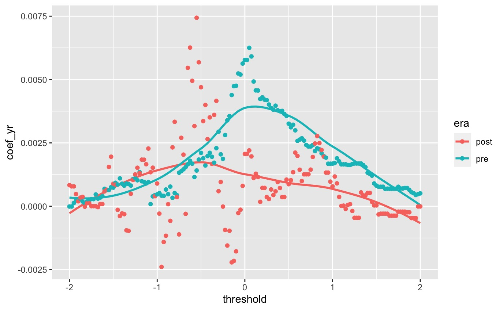

```{r setup, include=FALSE}
# setup chunks
knitr::opts_chunk$set(echo = F, fig.align = "center", warning = F, message = F, fig.height = 4)
# load libaries
library(knitr)
library(tidyverse)
library(grid)
library(moderndive)
library(gridExtra)
library(patchwork)
library(ISLR)
# load helper scripts
source(file = "R/header.R")
source(file = "R/report.R")
```

# Abstract

The competitive balance tax (implemented in 2002) is a rule implementing salary caps for baseball players in a given team. This paper attempts to uncover if there is any underlying difference in the number of lost potential players (called "couldabeens") in the pre-rule (1968-2002) and post-rule eras (2002-2018).

# Introduction 

Major League Baseball's "competitive balance tax," first implemented in 2002, has become a favorite subject of outrage among players and fans alike in recent years. On paper, the policy was meant to make the sport more competitive and boost salaries for players on lower-revenue teams. The owners and the players' union would negotiate the largest reasonable amount a team could spend on its roster, and any team that wanted to spend beyond that cap would pay a "tax" (a share of their excess payroll) to be redistributed to the poorer teams. In practice the policy has effectively become a salary cap, particularly after the 2016 renegotiations. In 2018 only two MLB teams out of thirty went over the salary threshold, and only one of those by any significant margin (the team that did so, the Boston Red Sox, unsurprisingly went on to win the World Series). With leaguewide revenue growth far outpacing growth in the revenue cap and most younger players effectively locked out of salary negotiations by free agency rules, players have understandably chafed at the limitation on their salaries, with mutterings of a player strike unless the rule is altered.

But while the depressive effect on players' salaries is not in dispute, the question of whether the rule *hurts the game* (a far graver sin among baseball fans than merely conspiring to lower salaries) is more open. At least in the conventional wisdom, the tax encourages teams to cultivate a massive pool of recruits and then pay the best of them the minimum permitted salary for up to seven years before they age into free agency. Once these players enter free agency, the narrative goes, the team dumps them for younger players whom they can pay the minimum salary. The remainder of their salary cap goes towards retaining a few older superstars with the name recognition to bring in fans, with many good-but-not-Mike-Trout players pushed into early retirement. The implication, then, is that the salary policy "hurts the game" because the MLB is less likely to be putting the best 30 shortstops in the world on the field at any given time. I would like to test this anecdotal observation empirically.

So, the working hypothesis states that since the advent of the competitive balance tax, the number of better players forced into retirement annually will have increased. A "better player forced into retirement" will be defined as a player under the age of 32 who a) left baseball due to their contract not being renewed, rather than injury or personal circumstances, and b) was outperforming the median rookie in their position at the time of their retirement. In other words, we might expect to find the number of couldabeens to increase after the implementation of the rule.

\newpage

# Methods: The Data

## WAR Data

Our data comes from https://stathead.com/baseball/ and we mainly have four sets of data.

1. Rookie pitchers
2. Rookie position players
3. Retired pitchers
4. Retired position players

## Payroll data

We also have data on the revenues and payrolls in the MLB for a given year.

1. MLB yearly payroll
2. MLB yearly total revenue

The research question in this paper hinges on classifying retired players of lost potential. To motivate this, we define a classifier for a "couldabeen" in the Classifiers section below. Before proceeding, we clarify the meaning of 'WAR', which is an essential statistic in our research.

## What is WAR?

The Wins Above Replacements (WAR) of position players and pitchers are calculated differently. 

### Position Player's WAR

$$
\text{WAR} = \frac{(\text{Player Runs} - \text{Avg Runs}) + (\text{Avg Runs} - \text{Replacement Runs})}
{\text{Game Runs to Wins Estimator}}
$$

$$
\text{Player Runs} = \text{Batting Runs} + \text{Baserunning Runs} + \text{Double Play Runs} + \text{Fielding Runs} + \text{Positional Adjustment}
$$

### Pitcher player's WAR

$$
\text{WAR} = \frac{(\text{aARA+aPRA) + (aRRA-aARA)}}
{\text{Game Runs to Wins Estimator}}
$$

where

\begin{table}[h]
\centering
 \begin{tabular}{||c || c||} 
 \hline
  Abrev. & Meaning \\ [0.5ex] 
 \hline\hline
 aARA & \text{Adjusted Average Runs Allowed} \\ 
 \hline
 aPRA & \text{Adjusted Player Runs Allowed} \\ 
 \hline
 aRRA & \text{Adjusted Replacement Runs Allowed} \\
 \hline
\end{tabular}
\caption{Abbreviations for Pitcher WAR.}
\end{table}

The “replacement-level player” used in WAR is an estimate for the average midseason replacement. Being better than a midseason replacement does not necessarily make you better than the generation of rookies actually replacing you. If we want to argue that a given retiree, on merit, should have kept playing, we require a higher standard.

\newpage

# Methods: Classifiers

We define a few classifers that are useful for our analysis.

## The Couldabeen Classifier

For a given year $Y$, we first compute the mean rookie's WAR, call it $\mu_Y$. Then, we construct the corrosponding classifier for "couldabeen" status $C$ of a given retired player $p$ (from the year $Y$) to be as follows:
\[
C(p) = \begin{cases}
True, \,  \text{WAR}_p \geq \mu_Y\\
False, \, \text{WAR}_p < \mu_Y 
\end{cases}
\]

## The Moneyball Classifier

To demonstrate that the release of *Moneyball* in 2003 is a fair place to partition the data, we perform a hypothesis test on the `postMoneyball` classifier of a year $Y$, which we define as follows:
\[
\text{postMoneyball}(Y) = \begin{cases}
True, Y > 2003 \\
False, Y \leq 2003
\end{cases}
\]


# Methods: Model Overview

## Data Wrangling Procedures

All that being said and done, we briefly describe the data wrangling procedures to obtain our response variable `prop` and our predictor `laborShare`.

(i) `prop`: Our crowning jewel in this research project is the creation of our year-indexed `prop` response variable: the rate of lost potential players ("couldabeens") in a given year. This variable is obtained by utilizing two classes of datasets in parallel: rookie player data and retiree player data. Note that the process for position players and pitcher players is not different, but we split these datasets due to the systemic differences in the WAR statistic for these classes of players. 

\par So, to compute `prop`, we begin by taking our rookie player dataset `player_rkes` and using `dplyr::group_by(Year)` to compute the yearly statistics for the mean rookie WAR. After doing so, we create a dataframe called `player_thresholds` listing these thresholds by year. Once this is done, we use these thresholds and count the number of retirees that exceed that threshold in that given year. Finally, we obtain the number of retirees that year and normalize to obtain the proportion. So, if we denote (for a given year $Y$) counted couldabeens $CB_Y$ and the number of retirees $R_Y$, we obtain the proportion or rate of couldabeens by letting $\text{prop}(Y) = \frac{CB_Y}{R_Y}$.

(ii) `laborShare`: From the payroll dataset, we have yearly data for the total revenue and total payrolls in MLB. This is quite convenient since our proportion response variable is similarly sorted by year. As such, we create the `laborShare` variable by using the following formula:

\[
\text{laborShare(Y)} = \frac{\text{totalPayroll(Y)}}{\text{totalRevenue(Y)}}
\]

\newpage

## Models

Once every retired player is classified appopriately, we run a few models and a hypothesis test:

(i) Linear Model (`prop ~ Year`): After aggregating all the retired players and their classifications, we summarize the data by year to obtain the proportion of retired players that were couldabeens that year, called `prop`. As such, we now have $50$ data points (for each year), and a response variable being the proportion of couldabeens. As such, we run a linear model fitting `prop ~ Year` for (i) the unpartitioned data, (ii) the pre-rule era and (iii) the post-rule era. Because there will always be "couldabeens", we do not expect a large effect size and hence a very significant result, however, the **sign** of our coefficient will be essential for our inference. If our research hypothesis is correct (that there is an effect), we expect to see a positive coefficient for $\beta_{Year}$ on the post-rule era partition.

(ii) Hypothesis Test (`prop ~ postMoneyball`): With the dummy variable `postMoneyball` at hand, we perform a hypothesis test to see if the mean proportion of couldabeens in the pre-Moneyball era is different than that of the post-Moneyball era. If the result of our hypothesis test is significant, we proceed to partition our dataset since it affirms our belief that the publication of 'Moneyball' is indeed a confounding variable.

(ii) Linear Model (`prop ~ laborShare`): Lastly, we use the payroll data to obtain the labor share in the MLB for a given year, and fit that data to `prop`. By establishing this relationship, we can utilize the result in Bradbury's paper regarding the relationship of labor share and the luxury tax to attempt to address our research question.

\newpage

# Exploratory Data Analysis

## WAR Density Plots

Below, we can visualize the densities of the WAR statistic for each type of player. In blue, we have the rookie players (with the median line denoted), and in red, we have the corrosponding retired players. As such, we can visualize the "couldabeens" as the retired players to the left of the median line (if the threshold $t = 0$), and we corrospondingly count the number of couldabeens based on year, from which we make our inference on the impact of Year.

\vspace{3em}

```{r, fig.height = 7, fig.width = 8}
if(bplot){grid.arrange(dens_pit, dens_pos, nrow = 2)}
```

\newpage

## Payroll Predictor Data

\vspace{1.5em}

```{r, fig.height = 8}
grid.arrange(plotpred1,plotpred2,plotpred3)
```

\newpage

# Models

```{r}
knitr::opts_chunk$set(echo = F, fig.align = "center", warning = F, message = F, fig.height = 2.75)
```

## Linear Model: Year

To answer our research question, we believe that we could establish the trend between `prop` by simply fitting the model against the year index `Year`. However, as we can see below, the data was non-linear, and fitting a model `prop ~ Year` lead to a coefficient of $\beta_{Year} \approx 0$ with an insignificant $p$-value of 0.440. This means the effect is essentially non-existent, and if it is, we cannot be sure this is not random (due to the statistical insignificance of $\beta_{Year}$). 

However, there is one particular feature of interest in our scatterplot data. Namely, there is a noticable "quadratic" shape in our `prop` data. Although it is not necessarily helpful to model a quadratic model for our research question, it does seem to indicate that there is an increase, then a drop again near our critical year of 2003. As such, we decide to further investigate this by putting our scope by splitting the data. However, we cannot just "ignore" data from previous years, so a formal investigation of the era partition is dicussed in the form of a hypothesis test.

```{r}
plot_lm1
summary(lm1)
```

\newpage

## Hypothesis Test: Why Split the Data?

As mentioned, we expect the Sabermetrics revolution to have reduced the number of couldabeens systemically. If we partition the eras, we find that the difference in means in proportion of couldabeens between the eras is statistically significant. Below, we have a boxplot to help us visualize the systemic drop in the proportion of couldabeens.

```{r}
ht_plot
```

To perform this hypothesis test, we perform a fit `prop ~ postMoneyball`. We know that if we fit a response to a dummy variable, the corrosponding parameter returned is the difference in means among the eras. Namely, if we obtain an intercept of $\beta_0$ and a parameter value of $\beta_p$ on the dummy variable, then performing least squares regression tells us that $\mu_{p = 0} = \beta_0$ and $\mu_{p = 1} = \beta_0 + \beta_p$. That being said, we perform the fit below.

```{r}
summary(ht)
```

As explained previously, we interpret the parameters as informing us of the difference in means in the corresponding levels of our dummy variable. This means that we have found that the mean of `prop` in the pre-Moneyball era is approximately $0.16$ and that of the post-Moneyball era is $0.12$. The result of this test is statistically significant, with a $p$-value of $0.0454$. As such, we proceed to partition the dataset to account for the systemic amount of reduction in couldabeen rates that is inherent in the post-Moneyball era as a result of the Sabermetrics revolution.

\newpage

# Models: Splitting the Data

## Linear Model: Pre-Moneyball Years

As demonstrated, it may be worthwhile to investigate `prop ~ Year` on the partitioned dataset making our partition based on the `postMoneyball` dummy variable. Once we do so, we fit the two seperate models fiting `prop ~ Year` in both eras. Firstly, we attempt to capture the trendline in the pre-Moneyball years. While this model is not particularly useful to fit this model (the scope of our research question is concerned with the post-Moneyball years), we fit this model to observe the effect size and trend in that era and do so anyway for completeness.

That being said, we observe a $\betayr = 0.004174$, interpreting this as saying that for every year after $1969$ until $2003$, we expect to see a $0.4\%$ increase in the rate of couldabeens. Interestingly, this trend is statistically significant with a $p$-value of approximately $0$. Again, we are not concerned with this era, so we go ahead and fit the model of the proportions in the post-Moneyball era.

```{r}
plot_lm2
summary(lm2)
```

\newpage

## Linear Model: Post-Moneyball Years


Finally, we come to our last and most important linear model, fitting `prop ~ Year` for data in the post-Moneyball era. Since the release of Moneyball coincides with the luxury tax (2003), we believe that accounting for this confounding variable may allow us to see the trendline in this era and make conclusions about the change in the rate of couldabeens in that era. That being said, we recall that the research hypothesis states that the luxury tax lead to a rise in the rate of couldabeens. To affirm this, one must find that $\betayr > 0$, since we would want to see that for every year after $2003$, there is some percentage increase in the proportion of retirees who are couldabeens. 

That being said, we observe a $\betayr = 0.002034$, interpreting this as saying that for every year after $2003$ until $2018$, we expect to see a $0.2\%$ increase in the rate of couldabeens. However, before prematurely concluding that the effect has been shown, we unforunately observe that this fit (and hence trendline) is **statistically insignificant** with a $p$-value of approximately $0.398$. To explain this, it may be helpful to observe the sizes of our partitions. Namely, it is possible that we simply do not have as much data in the post-Moneyball era as we did the pre-Moneyball era (15 data points as opposed to 35 data points), so running this a few more years into the future may potentially lead to a more statistically significant result based on `Year` alone. 

However, despite the fact, it is assuring that $\betayr > 0$, indicating that we may be going in the right direction. From this point onwards, there are two possible ways to go: (i) incorporate more data, or (ii) resampling the original data and observe a confidence interval. Next, we take the first strategy (i) and incorporate new data to make another linear model. We explore (ii) resampling in the *Results* section.


```{r}
plot_lm3
summary(lm3)
```

\newpage

## Labor Share Model

Since we could not establish a relationship between `prop` and `Year` alone in the post-Moneyball era, we seek another path by incorporating labor share data. As such, we obtain the payroll and revenue dataset for the MLB and run our new predictor against the rate of couldabeens; so, we fit `prop ~ labShare` and we obtain the following model.

Indeed, we find that labor share is negatively correlated to `prop` with $\beta_{LS} = -0.8670$. We may interpret this as saying that for every $1%$ increase in labor share, we might expect to find a decrease of $-0.8\%$ in the rate of couldabeens. This time around, our result is statistically significant with a $p$-value of $0.0845$. With respect to our research question, we may bring this back by citing the result of Bradbury's research on the effect of the luxury tax on labor share. 

If it is established that Bradbury's thesis that labor share is indeed decresaing as a result of the luxury tax, we may use that result in conjunction with this model to say the following:
\begin{quote}
Since lower labor shares indicates that the proportion of couldabeens is higher, the luxury tax may have been resulting in this increased rate of retired couldabeens with labor share as the intermediary variable. 
\end{quote}
This will be discussed further in the Results and Conclusions sections.

```{r}
plot_lm4
summary(lm4)
```

\newpage 

## Diagnostic Plots: Labor Share Model 

As our best-performing and most relevant model, we analyze the diagnostic plots of our linear model on labor share. At first glance, this model is not without problems. Namely, we notice that our residuals are not uniform as one might notice in the original model plot. In fact, the model has systemically higher residuals for smaller fitted values (near 0.10) indicating that years with higher labor share may be more difficult to predict. However, other than this issue of non-uniform residuals over all fitted values, the model seems to be well-behaved. Our Normal-QQ plot seems to be sufficiently close to the line, with slight deviations on the boundaries. Lastly, the leverage plot seems to indicate that there may be some high leverage points in the model. In fact, this may be confirmed by a quick glance at our model scatterplot. However, since this data is valid, we can say that these leverage points do not necessarily cause decreased confidence in the model output, but rather, may slightly skew the result in the wrong direction.  

```{r, fig.height = 4}
plot(lm4)
```

\newpage

# Results

## Linear Model on Year

**(Unpartitioned)**

- $\beta_{Year} \approx 0$. 
- If fitting `prop ~ Year` on the entire dataset, we find no linear relationship between proportion of couldabeens along the years.
- $\beta_{Year}$ is statistically insignificant with a high p-value of $p = 0.440$.
- There seems to be a "quadratic" trend in the data, so we investigate a partition.

## Hypothesis Test

- To justify partitioning the dataset, we theorize that `postMoneyball`, a dummy variable indicating if a year is before or after the release of Moneyball may lead us in the right direction.
- Namely, since Sabermetrics might lead to more efficient choices of rookies, we expect to see a drop in the proportion of couldabeens due to this increased efficiency.
- So, we fit `prop ~ postMoneyball` to perform a *difference of means* hypothesis test, measuring the likelihood of observing our data given that the mean `prop` before and after Moneyball is equal.
- In fact, we find that the means may not be equal as we obtain that $\beta_{MB} = -0.039$ with a $p$-value of $0.045$, indicating statistical significance and the rejection of the null hypothesis $(\mu_{Pre} = \mu_{Post})$ if $\alpha = 0.05$. Interpret this as saying that we expect to see an average of $4\%$ less in the rate of couldabeens in the post-Moneyball era.
- Finally, use this result to justify partitioning the dataset.

## Linear Model on Year

**(Pre-Moneyball era)** 

- Now that our dataset is partitioned, we may fit `prop ~ Year` in both eras.
- We fit the model and find that $\beta_{Year} = 0.004174$. 
- $\beta_{Year}$ is statistically significant with a very low p-value of $p \approx 0$.
- However, our research question is not concerned with this parameter. We do however find that the rate of couldabeens is increasing between $1968$ and $2003$.
- That being said, since we observe a $\betayr = 0.004174$, we interpret this as saying that for every year after 1969 until 2003, we expect to see a $0.4\%$ increase in the rate of couldabeens.
- Next, we fit the post-Moneyball era model for our research question.

**(Post-Moneyball era)** 

- $\beta_{Year} = 0.002034$. 
- $\beta_{Year} > 0$ supports the hypothesis that there is an increasing rate of couldabeens since the luxury tax (as it coincides with the release of Moneyball.
- More precisely, since we observe a $\betayr = 0.002034$, we interpret this as saying that for every year after 2003 until 2018, we expect to see a $0.2\%$ increase in the rate of couldabeens.
- Interestingly, this is a higher increase than that estimated in the pre-rule era.
- However, $\beta_{Year}$ is not statistically with a high p-value of $0.398$, so we may not base our inference on this parameter.
- Our next step is to either (i) bring in new data, or (ii) use resampling methods to estimate some confidence intervals.

\newpage

## Linear Model on Labor Share

- Since our post-Moneyball linear model was not statistically significant $(p = 0.398)$, we cannot base our inference on that model.
- However, along the way, we did learn that partioning the dataset is particularly helpful due to the result of our hypothesis test.
- Additionally, our result that $\betayr > 0$ in the post-Moneyball era indicates that we may be in the right direction. 
- To further investigate, we utilize payroll and revenue data to create a yearly labor share variable. Attaching this column to our proportion data, we have a new predictor.
- If the thesis of Bradbury's research holds, we have cause to believe that the luxury tax is leading to a shrinking labor share. 
- So, we fit a model `prop ~ labShare` and find $\beta_{LabShare} = -0.867$ with a $p$-value of $p = 0.084$. As opposed to the previous models, this is statistically significant and relevant to our research question.
- We interpret this as saying every for every $1\%$ increase in labor share, we might expect to find a decrease of $-0.8\%$ in the rate of couldabeens. So labor share is indeed **negatively** correlated with proportion of couldabeens.
- Since lower labor shares indicates that the proportion of couldabeens is higher, the luxury tax may have been resulting in this increased rate of retired couldabeens with labor share as the intermediary variable. 

\newpage

# Discussion

## Simpson's Paradox

```{r, fig.height = 5}
plot_simpsons
```

- Partitioning and fitting linear model with `prop ~ Year` yields $\beta_{Year} > 0$ in both partitions.
- However, if we do not make the partition, we find that $\beta_{Year} \approx 0$.  

Interestingly, when we choose not to partition the dataset into the post-rule and pre-rule eras and fit a linear model `Year ~ prop`, we find that a very resounding instance of Simpson's Paradox. In both partitions, we find that the parameter $\beta_{Year} > 0$. However, if we do not make the partition, we find that $\beta_{Year} \approx 0$. This raises some questions regarding the role our partition plays in our inference and modeling choices.

Firstly, this begs the question: should we partition the data? For the sake of valid statistical inference, if we assume `Year` is a valid predictor, it initially seems as though it would be errenous practice to do so. If we partition the data, we essentially say that our inferential result is **conditioned** on only that era's data (since our parameter is fit to only that data). As such, (assuming no confounding variable) it would be better statistical practice to not partition the data and only make inference on a $\beta_{Year}$ parameter trained on the entire dataset. 

However, as we can see, if we do not partition the data, our models suffer from Simpson's paradox and there seemingly is no trend along the years. As it suggests, there is indeed a possible explanation for why this partition is necessary. Some confounding variable(s) that the model failed to include (because we did not find and import the data yet) is any salary data (adjusted for inflation) or labor share data in a given year. The reason why this data might be particularly helpful to include in further renditions of this model is due to the fact that in the end, budgets are finite and they are what determines if a player continues playing or not regardless of their ability. 

As such, we believe that because the post-rule era and pre-rule era are fundamentally different in terms of team salary budgets (and related variables), it is valid and actually more statistically preferable to inform our inference in this way. So until such data is incorporated into the model in some form or another, the inference will be on the comparison of the $\beta_{Year}$ parameters from the two disjoint partitions.

\newpage

## Threshold Stability

Recall, that our couldabeen classifier was constructed as follows:

For a given year $Y$, we first compute the median rookie's WAR, call it $m_Y$. Additionally, compute the standard deviation of that data and call it $\sigma_Y$. Then, given a threshold $t \in \mathbb{R}$, we construct the corrosponding classifier for "couldabeen" status $C$ of a given retired player $p$ (from the year $Y$) to be as follows:
\[
C(p) = \begin{cases}
True, \,  \text{WAR}_p \geq m_Y + t\sigma_Y \\
False, \, \text{WAR}_p < m_Y + t\sigma_Y
\end{cases}
\]

All in all, we can see there are quite a few problems with our model. Although we have obtained a positive result on the slope of $\beta_{Year}$ for a particular threshold in the post-rule era, varying the threshold tells another story. In particular, if we run a linear model on the proportion of couldabeens against year i.e. `Year ~ prop` against a varying threshold (in standard deviations of rookie WAR), we found that $\beta_{Year}$ is quite unstable. Consider the graph below:


```{r, out.width= "80%", fig.cap = "Performance of the Linear Model against varying threshold for couldabeen status"}

```


One reason this instability may arise could be due to the fact that our thresholds for every year were calculated as a function of *only* that year's data. As such, the sample from which we obtain the threshold by each level (corrosponding to each year) is very small compared to the whole dataset; as such, small changes to the threshold cause high levels of noise in our final model. 

To treat this problem, we may reconsider our method of computing the threshold. Instead of strictly using just the data for a given year, it may be beneficial to "smooth" the threshold out by taking the data of that year and adjacent years (like a window). For instance, instead of considering just 2018 data, we may take 2017-2019 data for a "window length of 1". Hopefully, once this adjustment is made, our results will be more stable and less noisy with respect to the threshold, which should be just an arbitrary value rather than a value that carries so much weight in the entire inferential process.

Furthermore, the addition of some supplementary yearly salary/budgets data may be useful as another predictor since `Year` alone does not seem to have good explanatory power.

\newpage

## Resampling Results

\newpage

## Conclusions

To summarize:

- No correlation between year and proportion of couldabeens in full data set $(\beta_{Year} \approx 0)$.
- Positive but non-significant relationship between year and proportion of couldabeens when partitioned into pre- and post-*Moneyball* eras. 
- Significant negative relationship between publication of *Moneyball* and proportion of couldabeens. $(p = 0.045)$
- Somewhat significant negative relationship between labor share and proportion of couldabeens in post-*Moneyball* era. $(p = 0.084)$

Previous literature has established that the 2003 CBA, which implemented the luxury tax, led to a decline in labor share. We find *some* evidence for a link between a lower labor share and a higher proportion of "couldabeens" retiring. However, we cannot definitively conclude that the MLB luxury tax has increased the proportion of couldabeens.

\newpage

# Code Appendix

```{r, include=FALSE}
# setup chunks for code appendix
knitr::opts_chunk$set(echo = T, eval = FALSE, fig.align = "center", warning = F, message = F, fig.height = 4)
```

## Importing the Datasets

```{r}
# Load rookies datasets
df_pit_rkes <- read_csv("../data/rookie-pitcher.csv")
df_pos_rkes <- read_csv("../data/rookie-position.csv")
# Load retirees datasets
df_pit_ret <- read_csv("../data/retirees-pitcher.csv")
df_pos_ret <- read_csv("../data/retirees-position.csv")
```

## Wrangling the Datasets

```{r}
# select appopriate columns from player datasets
wrangle_init <- function(dataset){
  colnames(dataset)[3] <- "WAR"
  dataset %>% select(WAR, Year)
}
```

```{r}
# Obtain wrangled datasets
pit_rkes <- wrangle_init(df_pit_rkes)
pit_ret <- wrangle_init(df_pit_ret)
pos_rkes <- wrangle_init(df_pos_rkes)
pos_ret <- wrangle_init(df_pos_ret)
```

## Finding the Couldabeen Thresholds

```{r}
# obtain summary of WAR: median and variance
find_thresholds <- function(dataset, threshold = 0){
  dataset %>% 
    group_by(Year) %>%
    summarize(mean_WAR = mean(WAR), sd_WAR = sqrt(var(WAR))) %>%
    mutate(threshold = mean_WAR + threshold*sd_WAR) %>% 
    select(Year, threshold)
}
```

```{r}
# Get thresholds in each year
pit_thresholds <- find_thresholds(pit_rkes)
pos_thresholds <- find_thresholds(pos_rkes)
```

```{r}
head(pit_thresholds)
```


\newpage

## Classifying Retiree Couldabeens

```{r}
# Appends above_threshold column to retirees dataset (checks if a retiree exceeds a threshold)
compare_thresholds <- function(dataset, summary_dataset){
  above_threshold <- rep(NA, nrow(dataset))
  for(i in 1:nrow(dataset)){
    year <- as.numeric(dataset[i,2])
    above_threshold[i] <- (dataset[i,1] > summary_dataset[year - 1968, 2])
  }
  dataset <- cbind(dataset,above_threshold)
  colnames(dataset)[3] <- "above_threshold"
  dataset
}
```

```{r}
# See and record which players cross that year's adjusted threshold from rookie players
pit_ret <- compare_thresholds(pit_ret, pit_thresholds)
pos_ret <- compare_thresholds(pos_ret, pos_thresholds)
# Get all retired couldabeens by combining the rows 
retirees <- rbind(pit_ret,pos_ret)
```

```{r}
head(retirees)
```


## Counting Couldabeens by Year

```{r}
# Counts couldabeens in a given year
count_cbns <- function(dataset){
  dataset %>% 
    group_by(Year) %>%
    summarize(cbns = sum(above_threshold))
}
```

```{r}
# Count the retiree couldabeens by year
couldabeens <- count_cbns(retirees)
```

```{r}
#head(couldabeens)
```

\newpage

## Counting Retirees in a Given Year

```{r}
# Yields the sum of retirees in two datasets (pitchers, position commonly)
total_retirees_by_yr <- function(pitchers, position){
  year_count_pitchers <- retirees_by_yr(pitchers)$retirees
  year_count_position <- retirees_by_yr(position)$retirees
  data.frame(Year = 1969:2018, retirees = year_count_position + year_count_pitchers)
}
# Counts the retirees in a single dataset
retirees_by_yr <- function(dataset){
  year_count <- dataset %>%
    group_by(Year) %>%
    summarize(retirees = n())
}
```

```{r}
# Find number of retirees by year
num_retirees <- total_retirees_by_yr(df_pit_ret, df_pos_ret)
num_retirees <- data.frame(retirees = num_retirees)
```


```{r}
#head(num_retirees)
```

## Retiree Proportion of Couldabeens

```{r, echo = F}
# Remove year column
num_retirees <- data.frame(retirees = num_retirees$retirees.retirees)
```

```{r}
# Append number of retirees that year
couldabeens <- cbind(couldabeens, num_retirees)
# Find and append proportion of couldabeens : retirees
couldabeens <- couldabeens %>% mutate(prop = cbns/retirees)
```

```{r, eval = T}
#head(couldabeens)
```

\newpage

## Splitting the data

```{r}

```


\newpage 

# References

(1) https://stathead.com/baseball/
(2) Bradbury, John Charles. “What Explains Labor's Declining Share of Revenue in Major League Baseball?” (2019).
(3) https://blogs.fangraphs.com/mlbs-evolving-luxury-tax/
(4) Lewis, Michael. *Moneyball: The Art of Winning an Unfair Game*. New York: Norton, 2003.
(5) Hayes, Hannah. "What will Nate Silver do next?" *uchicago.edu*.
(6) Birnbaum, Phil. "Asking the Right Qustions." *SABR.org*.

